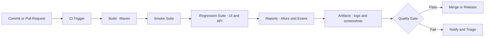
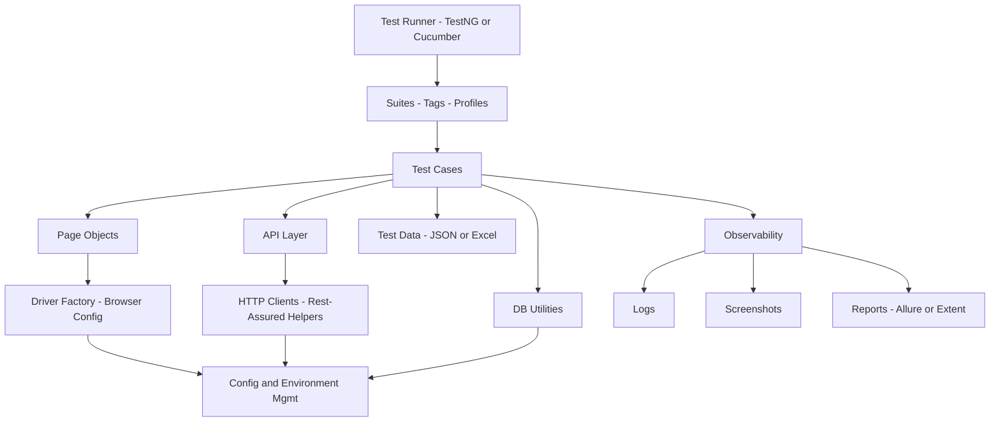

<!--
PROFILE README SETUP
1) Create a PUBLIC repository named exactly your GitHub username.
   For you: MK-MAN0JKUMAR/MK-MAN0JKUMAR
2) Add this file as README.md
3) Replace placeholders marked with: REPLACE_ME

REPLACE THESE VALUES
- LinkedIn URL:   REPLACE_ME_LINKEDIN_URL
- Email address:  REPLACE_ME_EMAIL

NOTES
- Mermaid errors usually happen when (a) the code fence is not exactly ```mermaid,
  (b) extra characters exist on the same line as the closing fence, or
  (c) some Mermaid parsers dislike certain punctuation inside node labels.
- The diagrams below use safer labels (no slashes, minimal punctuation).
-->

# Manoj Kumar
**Automation Test Engineer transitioning toward SDET**  
3.6+ years in software testing (Automation + Manual) | Framework Engineering | UI + API + CI/CD readiness

---

## Professional Summary
I build and evolve automation frameworks with a focus on **architecture**, **stability**, and **scalability**. My work emphasizes maintainable design (POM/service layers), strong diagnostics (logs/screenshots/reports), and execution models that fit **local development**, **regression**, and **CI pipelines**.

---

## Automation Engineering Focus
**What I optimize for in real-world automation:**
- Framework structure that supports fast onboarding and consistent patterns
- Flakiness control: synchronization strategy, deterministic assertions, actionable failure evidence
- CI-friendly execution: tagged suites, configurable environments, and report artifacts
- Clear separation of concerns (tests vs. page/service layers vs. utilities)

**Framework capabilities (implemented across projects):**
- Hybrid automation framework patterns
- Page Object Model (POM)
- Logging + screenshot capture
- Allure / Extent reporting
- TestNG execution model
- Data Driven Testing (DDT) (JSON/Excel where applicable)
- Parallel execution patterns (where supported by the framework design)
- Database validation utilities (MySQL checks where applicable)

---

## Technical Skills

### Automation / Test Stack
- **Selenium WebDriver**, **TestNG**, **Cucumber BDD**, **Maven**
- **Postman** (API testing)
- **JMeter** (performance testing)
- **MySQL** validation and data verification

### Programming
- **Java**, **SQL**

### Reporting & Evidence
- **Allure Reports**
- **Extent Reports**
- Logging + screenshots + artifacts for CI triage

---

## Current Learning Roadmap
- **API Automation with Rest-Assured** (enterprise patterns, reusable clients, schema validations)
- **CI/CD pipelines** using **GitHub Actions** and **Jenkins** (gates, artifacts, test stages)

## Forward Roadmap (Planned)
- Playwright with TypeScript
- AI-assisted testing (controlled usage and reviewable test design)
- LLM-based test data generation and AI debugging tools
- Self-healing automation (pragmatic application)
- AI agents for test workflows (triage, execution orchestration, coverage insights)
- CI/CD + AI integration; MCP Playwright ecosystem

---

## Featured Engineering Work
<!--
UI TIP (IMPORTANT): Pin these same repositories on your GitHub profile.
Go to your profile -> "Customize your pins" -> pick 3–6 flagship repos.
-->

### 1) Production-grade API Automation Framework
**Repo:** `restassured-enterprise-framework`  
**Stack:** Java, Rest-Assured, TestNG, Maven  
**What it demonstrates:** senior-style API framework structure, reusability, maintainability, and CI readiness  
- Request/response abstractions and reusable utilities
- Config-driven environment handling
- Reporting + logging suitable for pipelines
**Link:** https://github.com/MK-MAN0JKUMAR/restassured-enterprise-framework

### 2) Enterprise UI Automation Framework (CI/CD-ready)
**Repo:** `frameworkforge-sdet`  
**Stack:** Java, Selenium, TestNG, Maven  
**What it demonstrates:** maintainable POM design and execution profiles (local, regression, CI)  
- Clean test structure and reusable page layers
- Execution profile strategy for predictable runs
- CI-friendly organization for scheduled and gated runs
**Link:** https://github.com/MK-MAN0JKUMAR/frameworkforge-sdet

### 3) AI-assisted Playwright Automation Framework
**Repo:** `mcp_playwright_automation`  
**Stack:** JavaScript, Playwright, MCP, Copilot-assisted workflows  
**What it demonstrates:** modern E2E design and controlled AI usage for stability and maintainability  
- Scalable E2E suite structure
- Controlled AI usage patterns (review gates, consistent structure)
- Stability improvements and repeatable execution
**Link:** https://github.com/MK-MAN0JKUMAR/mcp_playwright_automation

### 4) Mobile Automation Framework (Appium + BDD)
**Repo:** `AppiumBDD_Master`  
**What it demonstrates:** mobile automation fundamentals with BDD-style test structure and maintainable patterns  
- BDD structure for readable mobile test scenarios
- Reusable step definitions and utilities for stability
- Framework base that can be extended for CI execution and reporting
**Link:** https://github.com/MK-MAN0JKUMAR/AppiumBDD_Master
  
### 5) Hybrid Framework (Selenium + Cucumber + TestNG)
**Repo:** `AutoHive_Framework`  
**Stack:** Java, Selenium, Cucumber, TestNG  
**What it demonstrates:** hybrid framework capabilities (DDT, evidence capture, reporting)  
- DDT with JSON/Excel (where applicable)
- Screenshot capture + logging + reporting
- Parallel execution patterns (Driver Factory approach)
**Link:** https://github.com/MK-MAN0JKUMAR/AutoHive_Framework

---

## Portfolio Architecture (Reference Diagrams)

### CI/CD Pipeline (Reference)


### Automation Framework Architecture (Reference)


---


<!--
## GitHub Statistics Dashboard
-->
<!--
If images are not rendering:
1) Confirm your profile repo README is public.
2) Wait a few minutes; GitHub sometimes caches README images.
3) Open each image URL in a browser to verify it loads.
4) If blocked/limited, add `&cache_seconds=21600` and try again.
-->

<!--
### Overview
[](https://github.com/MK-MAN0JKUMAR)

### Streak
[](https://github.com/MK-MAN0JKUMAR)

### Top Languages
[](https://github.com/MK-MAN0JKUMAR)

### Activity Graph
[](https://github.com/MK-MAN0JKUMAR)

---

## Contribution Graph
GitHub’s contribution graph is visible on my profile. I optimize for **meaningful changes**: framework improvements, documentation, CI integration, stability fixes, and repeatable execution patterns.
-->


## Contact
- **LinkedIn:** https://www.linkedin.com/in/mk-manojkumar0706
- **Email:** mk.manojkumar0706@gmail.com


<!--
UI + PROFILE ENHANCEMENTS (Recommended, professional-only)

1) PINNED REPOS (high impact)
- Pin 4 repos:
  - restassured-enterprise-framework
  - frameworkforge-sdet
  - mcp_playwright_automation
  - AutoHive_Framework

2) ADD CI BADGES (signals CI readiness)
- For each featured repo, add a GitHub Actions workflow and then add a badge at the top of that repo README.

3) MAKE EACH FEATURED REPO "RECRUITER-READY"
Add sections:
- Architecture overview (short)
- Folder structure
- How to run locally
- How to run in CI
- Reporting (sample screenshot)
- Test strategy (tags, suites, retry policy, flaky policy)

4) ADD A SHORT /docs IN FLAGSHIP REPOS
- docs/framework-architecture.md
- docs/execution-profiles.md
- docs/reporting-and-artifacts.md
- docs/ci-cd.md

5) KEEP THIS PROFILE README STABLE
- Avoid too many widgets.
- Prefer curated engineering content over decorative elements.
-->
