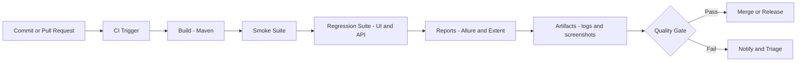
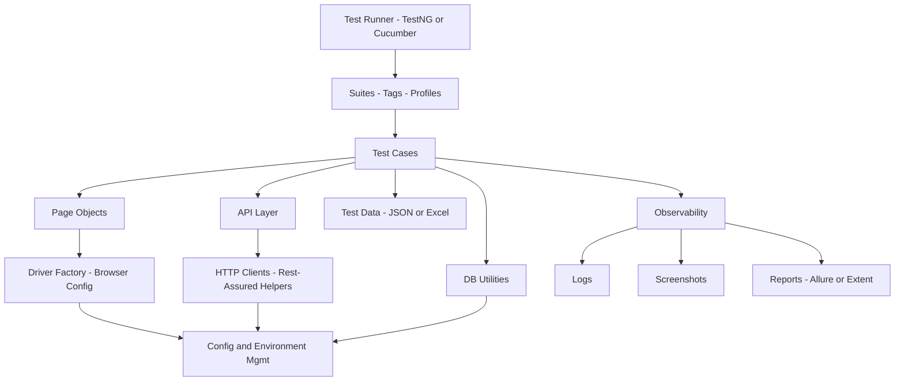

<!--
PROFILE README (Modern, professional, recruiter-first)
Repo: MK-MAN0JKUMAR/MK-MAN0JKUMAR
File: README.md

COLOR NOTE (IMPORTANT)
GitHub Profile README does not support custom CSS. Colors are achieved using:
- Shields.io badges (colored chips)
- Consistent widget themes (dark/light)
-->

<h1 align="left">Manoj Kumar</h1>

<!-- Colored + bold headline (badge-based; works reliably on GitHub) -->

<h3 align="left"><strong>Automation Test Engineer → SDET</strong></h3>
3.6+ years in software testing (Automation + Manual) | Framework Engineering | UI + API | CI/CD readiness

 

  
  
  

  
  
  
  
  
  

  
  
  
  
  
  
  

  
  
  
  
  
  

<table width="100%">
  <tr>
    <td width="68%" valign="top">

## About
I build and evolve automation frameworks with emphasis on **architecture**, **stability**, and **scalability**.  
My work emphasizes maintainable design (POM/service layers), strong diagnostics (logs/screenshots/reports), and execution models that fit **local development**, **regression**, and **CI pipelines**.

## Automation Engineering Focus
**What I optimize for in real-world automation:**
- Framework structure that supports fast onboarding and consistent patterns
- Flakiness control: synchronization strategy, deterministic assertions, failure evidence
- CI-friendly execution: tagged suites, configurable environments, and report artifacts
- Clear separation of concerns (tests vs. page/service layers vs. utilities)

**Framework capabilities (implemented across projects):**
- Hybrid automation framework patterns
- Page Object Model (POM)
- Logging + screenshot capture
- Allure / Extent reporting
- TestNG execution model
- Data Driven Testing (DDT) (JSON/Excel where applicable)
- Parallel execution patterns (where supported by the framework design)
- Database validation utilities (MySQL checks where applicable)

    </td>
    <td width="32%" valign="top">

## Snapshot
**Role target:** SDET I  
**UI automation:** Selenium, Playwright  
**Mobile:** Appium (BDD foundation)  
**API:** Postman; Rest-Assured   
**Build/Runner:** Maven, TestNG, Cucumber  
**Reporting:** Allure, Extent  
**Databases:** MySQL; SQL Server (validation)  
**Workflow:** Jira; Azure DevOps; Agile

 

## Upskilling Project 
- **Playwright with TypeScript**
- **API Automation with Rest-Assured** (reusable clients, validations)
- **CI/CD pipelines** using **GitHub Actions** and **Jenkins**

 

## Contact
- **LinkedIn:** https://www.linkedin.com/in/mk-manojkumar0706
- **Email:** mk.manojkumar0706@gmail.com

    </td>
  </tr>
</table>

## Featured Engineering Work
<!-- Pin these same repositories on your GitHub profile -->

<table width="100%">
  <tr>
    <td width="50%" valign="top">

### Production-grade API Automation Framework
<!--
**Repo:** `restassured-enterprise-framework`  
**Link:** https://github.com/MK-MAN0JKUMAR/restassured-enterprise-framework  
-->

**Stack:** Java, Rest-Assured, TestNG, Maven  
**What it demonstrates:** senior-style API framework structure, reusability, maintainability, and CI readiness  
- Request/response abstractions and reusable utilities
- Config-driven environment handling
- Reporting + logging suitable for pipelines

    </td>
    <td width="50%" valign="top">

### Enterprise UI Automation Framework (CI/CD-ready)
<!--
**Repo:** `frameworkforge-sdet`  
**Link:** https://github.com/MK-MAN0JKUMAR/frameworkforge-sdet
-->

**Stack:** Java, Selenium, TestNG, Maven  
**What it demonstrates:** maintainable POM design and execution profiles (local, regression, CI)  
- Clean test structure and reusable page layers
- Execution profile strategy for predictable runs
- CI-friendly organization for scheduled and gated runs

    </td>
  </tr>

  <tr>
    <td width="50%" valign="top">

### AI-assisted Playwright Automation Framework
<!--
**Repo:** `mcp_playwright_automation`  
**Link:** https://github.com/MK-MAN0JKUMAR/mcp_playwright_automation  
-->

**Stack:** JavaScript, Playwright, MCP, Copilot-assisted workflows  
**What it demonstrates:** modern E2E design and controlled AI usage for stability and maintainability  
- Scalable E2E suite structure
- Controlled AI usage patterns (review gates, consistent structure)
- Stability improvements and repeatable execution

    </td>
    <td width="50%" valign="top">

### Hybrid Framework (Selenium + Cucumber + TestNG)
<!--
**Repo:** `AutoHive_Framework`  
**Link:** https://github.com/MK-MAN0JKUMAR/AutoHive_Framework
-->

**Stack:** Java, Selenium, Cucumber, TestNG  
**What it demonstrates:** hybrid framework capabilities (DDT, evidence capture, reporting)  
- DDT with JSON/Excel (where applicable)
- Screenshot capture + logging + reporting
- Parallel execution patterns (Driver Factory approach)

    </td>
  </tr>

  <tr>
    <td width="50%" valign="top">

### Mobile Automation Framework (Appium + BDD)
<!--
**Repo:** `AppiumBDD_Master`  
**Link:** https://github.com/MK-MAN0JKUMAR/AppiumBDD_Master  
-->

**What it demonstrates:** mobile automation fundamentals with BDD-style test structure and maintainable patterns  
- BDD structure for readable mobile test scenarios
- Reusable step definitions and utilities for stability
- Framework base that can be extended for CI execution and reporting

    </td>
    <td width="50%" valign="top">

### Roadmap emphasis
- API automation maturity (Rest-Assured patterns)
- CI execution quality gates and reporting artifacts
- Scalable automation design across UI, API, and mobile
- AI-assisted workflows (controlled usage) for productivity and stability

    </td>
  </tr>
</table>

## Architecture (Reference)

  
<strong>CI/CD Pipeline (Reference)</strong>

  
<strong>Automation Framework Architecture (Reference)</strong>

## Upskill Roadmap

  
<strong>Current Project</strong>

- **Playwright with TypeScript**
- **API Automation with Rest-Assured** (enterprise patterns, reusable clients, schema validations)
- **CI/CD pipelines** using **GitHub Actions** and **Jenkins** (gates, artifacts, test stages)  

  
<strong>Forward Roadmap</strong>

   
- AI-assisted testing (controlled usage and reviewable test design)
- LLM-based test data generation and AI debugging tools
- Self-healing automation (pragmatic application)
- AI agents for test workflows (triage, execution orchestration, coverage insights)
- CI/CD + AI integration; MCP Playwright ecosystem

<!--
## GitHub Statistics Dashboard (Optional)
Keep for future use. When needed, uncomment this section.

Recommended modern themes:
- Dark: theme=github_dark
- Light: theme=default
Keep the same theme across all widgets.

### Overview

### Streak

### Top Languages

### Activity Graph

-->

<!--
HIGH-IMPACT IMPROVEMENTS
1) Pin the same repos you list above.
2) Add GitHub Actions workflows to top 2 repos and upload reports as artifacts.
3) Update each featured repo README with: architecture, run steps, CI steps, sample report screenshot.
-->

